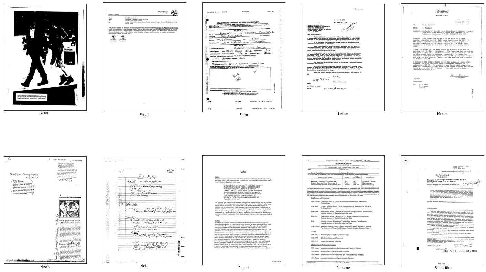
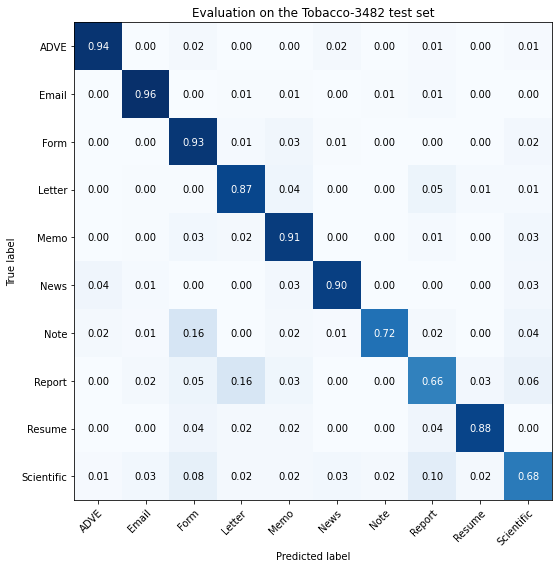

# Document image classification on the Tobacco-3482 dataset using multi-modal CNNs

This Colab notebook illustrates how to use multi-modal convolutional neural networks in Tensorflow to classifiy document images from the Tobacco-3482 dataset. The dataset contains single-page scans of 10 different types of business documents, as seen in the following examples:

The architecture fuses an image path based on an ImageNet-pretrained VGG16 network, and a text path using a Tf-Idf featurisation. The notebook illustrates how to create `tf.data.Dataset` pipelines for multi-modal (image + text) input, and how to use the `TextVectorization` layer from `tf.keras.layers.experimental.preprocessing`.

On a random train/test split, the given network achieves around 86% accuracy on the 10 classes of the Tobacco-3482 dataset. This is close to results of recent publications with similar or more complicated network architectures, such as [1] and [2].

[1] Audebert et. al.: Multimodal deep networks for text and image-based document classification, ArXiv 2019 [pdf](https://arxiv.org/abs/1907.06370)

[2] Ferrando et. al.: Improving Accuracy and Speeding Up Document Image Classification Through Parallel Systems, ICCS 2020 [link](https://link.springer.com/chapter/10.1007%2F978-3-030-50417-5_29)
